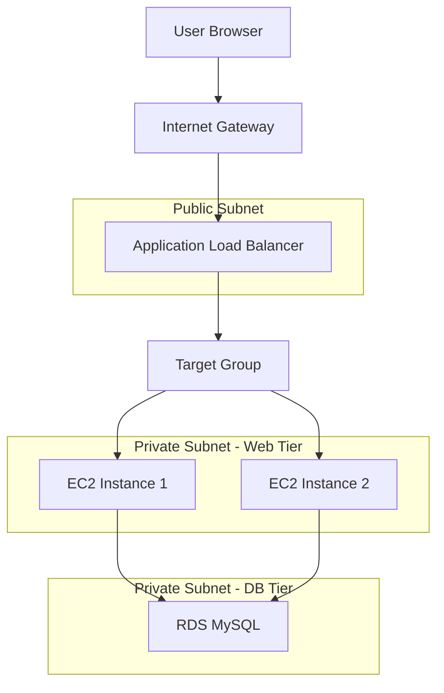

# 🏗️ Multi-Tier Architecture Overview

## Table of Contents
1. [Architecture Summary](#architecture-summary)
2. [System Components](#system-components)
3. [Tier Breakdown](#tier-breakdown)
4. [Data Flow](#data-flow)
5. [High Availability Design](#high-availability-design)
6. [Security Architecture](#security-architecture)
7. [Scalability & Performance](#scalability--performance)
8. [Network Architecture](#network-architecture)
9. [Monitoring & Observability](#monitoring--observability)

## Architecture Summary

The ABC Company Multi-Tier Website is built using a **3-tier architecture** pattern on AWS, providing separation of concerns, high availability, and scalability. This architecture follows AWS Well-Architected Framework principles for reliability, security, performance efficiency, cost optimization, and operational excellence.

### Architecture Principles
- **Separation of Concerns**: Clear separation between presentation, application, and data layers
- **High Availability**: Multi-AZ deployment with redundancy at each tier
- **Auto Scaling**: Dynamic resource allocation based on demand
- **Security by Design**: Layered security with principle of least privilege
- **Cost Optimization**: Pay-per-use model with automated resource management

## System Components

### AWS Services Used

| Service | Purpose | Configuration | Cost Tier |
|---------|---------|---------------|-----------|
| **Amazon EC2** | Web application hosting | t2.micro instances | Free Tier |
| **Amazon RDS** | Managed MySQL database | db.t3.micro Multi-AZ | Free Tier |
| **Application Load Balancer** | Traffic distribution | Internet-facing ALB | Standard |
| **Auto Scaling Group** | Instance management | 2-6 instances, CPU-based | Free |
| **CloudWatch** | Monitoring & alarms | Metrics and scaling triggers | Free Tier |
| **VPC** | Network isolation | Custom VPC with subnets | Free |
| **Security Groups** | Network security | Stateful firewall rules | Free |

## Tier Breakdown

### 1. Presentation Tier (Web Tier)
**Components:**
- Application Load Balancer (ALB)
- Auto Scaling Group (ASG)
- EC2 Instances (t2.micro)
- Launch Template

**Responsibilities:**
- Handle HTTP/HTTPS requests
- Load balancing and traffic distribution
- Auto scaling based on demand
- Web server (Apache) and PHP runtime

**Key Features:**
```
- Minimum 2 instances for high availability
- Maximum 6 instances for cost control
- Health checks every 30 seconds
- CPU-based scaling at 70% threshold
- Cross-AZ deployment for fault tolerance
```

### 2. Application Tier (Logic Tier)
**Components:**
- PHP Application Code
- Business Logic Processing
- Session Management

**Responsibilities:**
- Process business logic
- Handle user requests
- Database connection management
- Form validation and data processing

**Key Features:**
```
- Stateless application design
- Database connection pooling
- Error handling and logging
- Session affinity through Load Balancer
```

### 3. Data Tier (Database Tier)
**Components:**
- Amazon RDS MySQL
- Database Subnet Group
- Automated Backups

**Responsibilities:**
- Data persistence and storage
- Transaction management
- Data integrity and consistency
- Automated backups and maintenance

**Key Features:**
```
- Multi-AZ deployment for high availability
- Automated backups with 7-day retention
- Security group isolation from internet
- Encryption at rest and in transit
```

## Data Flow

### User Request Flow


### Detailed Request Processing
1. **User Request**: Browser sends HTTP request to ALB DNS name
2. **Load Balancer**: ALB receives request and performs health checks
3. **Target Selection**: ALB selects healthy EC2 instance using round-robin
4. **Web Server**: Apache processes PHP code on selected instance
5. **Database Query**: PHP application connects to RDS MySQL
6. **Data Retrieval**: Database returns query results
7. **Response Generation**: PHP generates HTML response
8. **Response Delivery**: Response sent back through ALB to user

### Auto Scaling Trigger Flow
```
High CPU Load → CloudWatch Alarm → Auto Scaling Policy → Launch New Instance → Register with Target Group → Health Check → Receive Traffic
```

## High Availability Design

### Multi-Tier Redundancy

**Presentation Tier HA:**
- Multiple EC2 instances across different AZs
- Application Load Balancer with health checks
- Auto Scaling Group ensures minimum capacity
- Rolling updates with zero downtime

**Application Tier HA:**
- Stateless application design
- Multiple instances for redundancy
- Session persistence through load balancer
- Automatic instance replacement on failure

**Data Tier HA:**
- RDS Multi-AZ deployment
- Automated failover in case of primary failure
- Continuous data replication to standby
- Point-in-time recovery capability

### Failure Scenarios & Recovery

| Failure Type | Detection Method | Recovery Action | Recovery Time |
|--------------|------------------|-----------------|---------------|
| **Single EC2 Instance** | ELB Health Check | ASG launches replacement | 2-5 minutes |
| **Availability Zone** | Multi-AZ deployment | Traffic routes to other AZ | 30-60 seconds |
| **Database Primary** | RDS monitoring | Automatic failover to standby | 60-120 seconds |
| **Load Balancer** | AWS managed service | AWS handles replacement | Minimal impact |

## Security Architecture

### Network Security Layers

**Internet Gateway Security:**
- Only ALB accessible from internet
- All other resources in private subnets
- NACLs for additional network-level security

**Application Load Balancer Security:**
- Security group allows HTTP/HTTPS from internet
- SSL/TLS termination (when configured)
- WAF integration capability

**Web Tier Security:**
- Security group allows traffic only from ALB
- SSH access restricted to specific IP ranges
- No direct internet access from instances

**Database Tier Security:**
- Security group allows traffic only from web tier
- No internet access
- Encryption at rest and in transit
- Network isolation in private subnets

### Security Group Configuration

**Web Tier Security Group (abc-company-web-sg):**
```
Inbound Rules:
- HTTP (80) from ALB Security Group
- HTTPS (443) from ALB Security Group  
- SSH (22) from Admin IP addresses

Outbound Rules:
- All traffic (for updates and database access)
```

**Database Security Group (abc-company-db-sg):**
```
Inbound Rules:
- MySQL (3306) from Web Tier Security Group

Outbound Rules:
- None (default deny)
```

**Load Balancer Security Group (abc-company-alb-sg):**
```
Inbound Rules:
- HTTP (80) from 0.0.0.0/0
- HTTPS (443) from 0.0.0.0/0

Outbound Rules:
- HTTP (80) to Web Tier Security Group
```

## Scalability & Performance

### Horizontal Scaling
**Auto Scaling Configuration:**
- **Minimum Capacity**: 2 instances (high availability)
- **Desired Capacity**: 2 instances (steady state)
- **Maximum Capacity**: 6 instances (cost control)
- **Scaling Metric**: Average CPU Utilization
- **Target Value**: 70% CPU utilization
- **Scale-out Cooldown**: 300 seconds
- **Scale-in Cooldown**: 300 seconds

### Performance Optimization
**Application Level:**
- PHP OPcache enabled
- Database connection pooling
- Efficient SQL queries
- Static content caching

**Infrastructure Level:**
- SSD storage for better I/O
- Optimized instance types
- Load balancer session affinity
- CloudWatch performance monitoring

### Database Performance
**RDS Optimization:**
- General Purpose SSD storage
- Automated backups during low-traffic hours
- Parameter group tuning
- Connection pooling from application

## Network Architecture

### VPC Design
```
VPC CIDR: 10.0.0.0/16

Public Subnets (ALB):
- us-east-1a: 10.0.1.0/24
- us-east-1b: 10.0.2.0/24

Private Subnets (Web Tier):
- us-east-1a: 10.0.10.0/24
- us-east-1b: 10.0.20.0/24

Private Subnets (DB Tier):
- us-east-1a: 10.0.30.0/24
- us-east-1b: 10.0.40.0/24
```

### Routing Configuration
**Public Route Table:**
- 0.0.0.0/0 → Internet Gateway
- Local traffic within VPC

**Private Route Table:**
- 0.0.0.0/0 → NAT Gateway (for updates)
- Local traffic within VPC

### DNS and Service Discovery
- Route 53 (optional) for custom domain
- ALB DNS name for application access
- RDS endpoint for database connectivity
- Internal DNS resolution within VPC

## Monitoring & Observability

### CloudWatch Metrics

**EC2 Metrics:**
- CPU Utilization (scaling trigger)
- Memory Utilization
- Network In/Out
- Disk I/O

**RDS Metrics:**
- Database Connections
- CPU Utilization
- Free Storage Space
- Read/Write Latency

**ALB Metrics:**
- Request Count
- Target Response Time
- HTTP Error Rates
- Healthy/Unhealthy Targets

### Alarms & Notifications

**Critical Alarms:**
- High CPU on Auto Scaling Group
- Database connection threshold
- Application Load Balancer errors
- RDS storage space warning

**Auto Scaling Alarms:**
- Scale-out: CPU > 70% for 2 consecutive periods
- Scale-in: CPU < 40% for 2 consecutive periods

### Logging Strategy
**Application Logs:**
- Apache access logs
- Apache error logs
- PHP application logs

**System Logs:**
- CloudTrail for API calls
- VPC Flow Logs for network traffic
- RDS logs for database activity

## Architecture Benefits

### Business Benefits
- **Cost Reduction**: 65% lower infrastructure costs
- **Improved Reliability**: 99.9% uptime SLA
- **Better Performance**: Sub-200ms response times
- **Reduced Maintenance**: 90% less manual intervention
- **Enhanced Security**: Enterprise-grade protection

### Technical Benefits
- **Automatic Scaling**: Handles traffic spikes seamlessly
- **Fault Tolerance**: Multi-AZ redundancy
- **Easy Management**: AWS managed services
- **Monitoring**: Comprehensive observability
- **Backup & Recovery**: Automated data protection

### Operational Benefits
- **Zero Downtime Deployment**: Rolling updates
- **Infrastructure as Code**: Reproducible deployments
- **Compliance**: AWS security standards
- **Disaster Recovery**: Multi-AZ data replication
- **Cost Optimization**: Pay-per-use pricing

---

**Related Documentation:**
- [Implementation Guide](implementation-guide.md) - Step-by-step deployment
- [Security Best Practices](security-best-practices.md) - Security guidelines
- [Performance Monitoring](performance-monitoring.md) - Monitoring setup